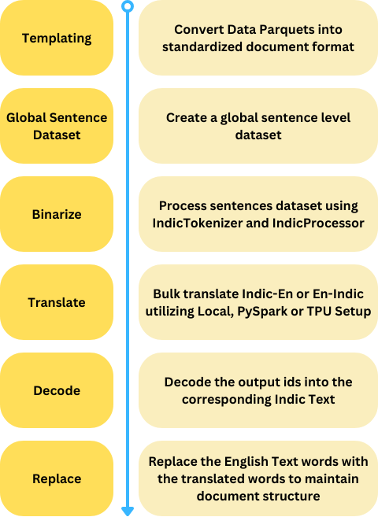

# Setu-Translate: A Large Scale Translation Pipeline

Setu-Translate uses [IndicTrans2 (IT2) ](https://github.com/AI4Bharat/IndicTrans2) for performing large-scale translation across English and 22 Indic Languages.

Currently, we provide inference support for [PyTorch](https://pytorch.org/get-started/locally/) and [Flax](https://flax.readthedocs.io/en/latest/index.html) versions of IT2. TPUs can be used for large-scale translation by leveraging Flax port of IT2.


# Table of Contents


1. [Overview](#overview)
2. [Quickstart](#quickstart)
3. [Usage](#usage)


## Overview

The Setu-Translate Pipeline contains 4 main stages:

- [Templating](./stages/perform_templating.py) : Each dataset is input to the pipeline in parquet format. During this stage, each entry in the dataset is converted into a [Document](./stages/document.py#L9) object format. During conversion additional steps such as text cleaning, chunking, remove duplicates, delimitter splitting, etc. are performed. 

- [Global Sentence Dataset](./stages/create_global_ds.py) : During this stage, the templated datafiles are processed and formatted into a sentence level dataset based on doc_ids.

- [Binarize](./stages/binarize.py) : During this stage, the sentences are processed using the [IndicProcessor](./IndicTransTokenizer/IndicTransTokenizer/utils.py#L14) and [IndicTransTokenizer](./IndicTransTokenizer/IndicTransTokenizer/tokenizer.py#L11) based on the source and target language. Further we perform padding and save the output either in numpy (np) or pytorch (pt) format.

- [Translate](./stages/tlt_pipelines/translate_joblib.py) The translation stage utilizes [IndicTrans2](https://huggingface.co/ai4bharat/indictrans2-en-indic-dist-200M) translation model to translate the English sentences to the corresponding target Indic languages. We provide support to run translation either on [local](./stages/tlt_pipelines/translate_joblib.py) or [TPU](./stages/tpu/translate_tpu_pmap.py) cluster for larger datasets.

- [Decode](./stages/decode.py) The decode stages process the model output data and replaces the translated ids into their corresponding Indic Text and provides us with the translated text.

- [Replace](./stages/replace.py) During this stage, the translated words are appropriately replaced with the original text positions to maintain document structure. This depends on the output of the templating stage.

## Quickstart

1. Clone repository
```bash
git clone https://github.com/AI4Bharat/setu-translate.git
```
2. Prepare environment
```bash
conda create -n translate-env python=3.10
conda activate translate-env
conda install pytorch torchvision torchaudio pytorch-cuda=11.8 -c pytorch -c nvidia
conda install -c conda-forge pyspark
conda install pip
pip install datasets transformers
```
3. Install IndicTransTokenizer
```bash
cd IndicTransTokenizer

pip install --editable ./
```

4. Install JAX and Setup for TPU

Based on your setup (local or TPU) download the appropriate JAX libraries accordingly from [JAX Installation](https://github.com/google/jax#installation).


Also download the [Flax Weights](https://ai4b-public-nlu-nlg.objectstore.e2enetworks.net/ai4b-public-nlu-nlg/sangraha/translation/it2_flax_weights.tar.gz) for IndicTrans2 and store it at ```setu-translate/stages/tpu/flax_weights/200m```.

## Usage
### Templating Stage
```bash
HF_DATASETS_CACHE=/home/$USER/tmp python perform_templating.py \
    --glob_path "/home/$USER/setu-translate/examples/sample_data/wiki_en_data.parquet" \
    --cache_dir_for_original_data "/home/$USER/setu-translate/examples/cache" \
    --base_save_path "/home/$USER/setu-translate/examples/output/wiki_en/doc_csvs" \
    --save_path "/home/$USER/setu-translate/examples/output/wiki_en/templated" \
    --text_col body \
    --url_col url \
    --timestamp_col timestamp \
    --source_type wiki_en \
    --translation_type sentence \
    --use_cache False \
    --split "train[:5%]"
```
### Global Sentence Dataset Stage
```bash
HF_DATASETS_CACHE=/home/$USER/tmp python create_global_ds.py \
    --paths_data "/home/$USER/setu-translate/examples/output/wiki_en/templated/*.arrow" \
    --cache_dir "/home/$USER/setu-translate/examples/cache" \
    --global_sent_ds_path "/home/$USER/setu-translate/examples/output/wiki_en/sentences"
```
### Binarize Dataset Stage
```bash
HF_DATASETS_CACHE=/home/$USER/tmp python binarize.py \
    --root_dir "/home/$USER/setu-translate" \
    --data_files "/home/$USER/setu-translate/examples/output/wiki_en/sentences/*.arrow" \
    --cache_dir "/home/$USER/setu-translate/examples/cache" \
    --binarized_dir "/home/$USER/setu-translate/examples/output/wiki_en/binarized_sentences" \
    --batch_size 2048 \
    --total_procs 1 \
    --padding max_length \
    --src_lang eng_Latn \
    --tgt_lang hin_Deva \
    --return_format np
```
### Translate Stage
```bash
HF_DATASETS_CACHE=/home/$USER/tmp python tlt_pipelines/translate_joblib.py \
    --root_dir "/home/$USER/setu-translate" \
    --data_files "/home/$USER/setu-translate/examples/output/wiki_en/binarized_sentences/*.arrow" \
    --cache_dir "/home/$USER/setu-translate/examples/cache" \
    --base_save_dir "/home/$USER/setu-translate/examples/output/wiki_en/model_out" \
    --joblib_temp_folder "/home/$USER/setu-translate/tmp" \
    --batch_size 512 \
    --total_procs 1 \
    --devices "0"
```

### Decode Stage
```bash
HF_DATASETS_CACHE=/home/$USER/tmp python decode.py \
    --root_dir "/home/$USER/setu-translate" \
    --data_files "/home/$USER/setu-translate/examples/output/wiki_en/model_out/*/*.arrow" \
    --cache_dir "/home/$USER/setu-translate/examples/cache" \
    --decode_dir "/home/$USER/setu-translate/examples/output/wiki_en/decode" \
    --batch_size 64 \
    --total_procs 1 \
    --src_lang eng_Latn \
    --tgt_lang hin_Deva \
```

### Replace Stage
```bash
HF_DATASETS_CACHE=/home/$USER/tmp python replace.py \
    --paths_data "/home/$USER/setu-translate/examples/output/wiki_en/templated/*.arrow" \
    --cache_dir "/home/$USER/setu-translate/examples/cache" \
    --batch_size 64 \
    --num_procs 1 \
    --decode_base_path "/home/$USER/setu-translate/examples/output/wiki_en decode/*.arrow" \
    --translated_save_path "/home/$USER/setu-translate/examples/output/wiki_en/translated"
```


